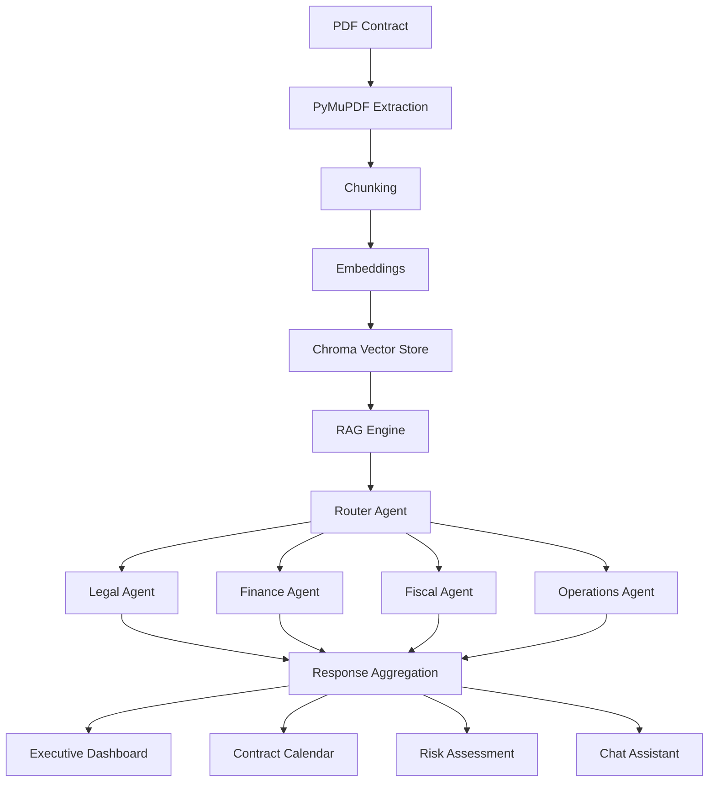

# 📑 Contract Analysis with Multi-Agent AI 
### AI-Powered Contract Intelligence Platform using RAG, Multi-Agent Systems and Semantic Search

## Overview

Claro, puedes cambiarlo así:

ContratosVertiche is an AI-driven contract analysis platform designed for a retail company use case, focused on supporting the analysis of lease agreements and transforming unstructured legal documents into actionable business intelligence.

The project was developed to help a retail organization analyze rental contracts more efficiently, identify legal and financial risks, monitor expiration dates, extract key obligations, and support decision-making related to leased commercial properties.

The solution combines:

* Retrieval-Augmented Generation (RAG)
* Semantic Search
* Multi-Agent AI Architecture
* Financial Analysis
* Legal Risk Detection
* Contract Monitoring
* Executive Dashboards

The platform enables retail organizations to analyze lease agreements at scale, detect potential risks, monitor critical contract dates, extract obligations, compare relevant clauses, and generate insights that support legal, financial, and operational decision-making.

---

# Business Problem

Contract review is traditionally:

- Time-consuming
- Dependent on specialists
- Difficult to scale
- Prone to oversight

Organizations managing large contract portfolios often struggle with:

- Renewal tracking
- Hidden liabilities
- Financial commitments
- Compliance obligations

---

# Business Objectives

### Reduce Review Time

Accelerate contract analysis through AI.

### Improve Risk Visibility

Identify legal, financial and operational risks.

### Centralize Knowledge

Create a searchable contract repository.

### Enable Decision Support

Provide actionable insights for executives.

### Improve Compliance

Track contractual obligations and deadlines.

---

# System Architecture



---

# End-to-End Workflow

## 1. Contract Upload

Users upload PDF contracts.

Supported workflow:

```text
PDF → Extraction → Analysis
```

---

## 2. Document Processing

Implemented using:

- PyMuPDF
- RecursiveCharacterTextSplitter

The document is segmented into semantic chunks.

---

## 3. Embedding Generation

Current implementation:

```python
all-MiniLM-L6-v2
```

Purpose:

Transform text into vector representations.

---

## 4. Vector Database Indexing

Implemented using:

```python
Chroma
```

Allows semantic retrieval of contract information.

---

## 5. Retrieval-Augmented Generation

Implemented in:

```python
core/rag.py
```

Capabilities:

- Context retrieval
- Evidence-based responses
- Reduced hallucinations

---

## 6. Multi-Agent Orchestration

Router Agent delegates requests to specialists.

### Legal Agent

Analyzes:

- Clauses
- Penalties
- Guarantees
- Obligations

### Finance Agent

Analyzes:

- Rent
- Escalations
- Cash flows
- Financial commitments

### Fiscal Agent

Analyzes:

- Taxes
- VAT implications
- Fiscal responsibilities

### Operations Agent

Analyzes:

- Maintenance
- Operational obligations
- Property restrictions

---

## 7. Contract Intelligence

Automatic extraction of:

- Contract term
- Start date
- End date
- Financial obligations
- Critical clauses
- Risk indicators

---

## 8. Calendar Generation

Implemented in:

```python
core/calendar.py
```

Automatically creates:

- Renewal reminders
- Expiration alerts
- Negotiation windows

---

## 9. Executive Dashboard

Built with:

- Streamlit
- Plotly

Provides:

- Portfolio KPIs
- Risk summaries
- Financial indicators
- Contract metrics

---

# Technology Stack

## AI & LLMs

- OpenAI
- RAG
- Prompt Engineering

## NLP

- Semantic Search
- Document Chunking
- Information Extraction

## Vector Search

- Chroma
- HuggingFace Embeddings

## Backend

- Python

## Frontend

- Streamlit

## Database

- Supabase

## Visualization

- Plotly

## PDF Processing

- PyMuPDF

---

# Key Features

### AI Contract Assistant

Conversational contract analysis.

### Semantic Retrieval

Evidence-based answers.

### Multi-Agent Architecture

Domain-specific reasoning.

### Financial Analysis

Cashflow projection support.

### Contract Calendar

Automated expiration monitoring.

### Dashboard Analytics

Portfolio-level visibility.

---

# Impact Metrics

Potential KPIs:

| Metric | Impact |
|----------|----------|
| Review Time | Reduced |
| Risk Detection | Increased |
| Manual Analysis | Reduced |
| Contract Visibility | Increased |
| Renewal Tracking | Improved |

---

# Results and Learnings

## Technical Learnings

- Multi-agent orchestration
- Retrieval-Augmented Generation
- Vector databases
- Contract intelligence systems
- Prompt engineering

## Business Learnings

- LegalTech workflows
- Compliance automation
- Knowledge management
- Decision intelligence

